# 1. 서비스 소개


## 1) Newbit이란?

`Newbit`은 Tistory, Velog, Notion 등 다양한 플랫폼에 파편화되어있는 `기술블로그`의 글을 모아서 볼 수 있는 `큐레이션 SNS 서비스`입니다. 관심 기술을 설정하면 해당 기술을 다루는 글을 추천하여 보여주기 때문에 번거롭게 시간을 들여 정보를 찾아 헤맬 필요가 없습니다. 마음에 드는 글은 같은 관심사를 공유하는 팔로워들과 함께 공유해보세요! 공유하고 토론함으로써 동료 효과(peer effect)를 통한 효과적 학습이 가능합니다. 짧은 리뷰를 덧붙이는 것만으로도 기억에 오래 남는다는 사실을 알고 계신가요? 지금 바로 Newbit에서 기술 공부를 시작해보세요!

## 2) 개발기간

- 2022-01-10 ~ 2022-02-18 (총6주)
  - Sub1 : 2021-01-10 ~ 2021-01-14
  - Sub2 : 2021-01-17 ~ 2021-01-28
  - Sub3 : 2021-01-31 ~ 2021-02-18 (Now!)

## 3) 산출물 모아보기

**와이어프레임**

👉 [Figma](https://www.figma.com/file/3Yc8FTFfCSgsZhxIR3m7bS/Newbit?node-id=0%3A1) 에서 살펴보기

👉 [영상](https://youtu.be/n6Ijs8BZ3ts) 으로 확인하기

**컴포넌트 구조도**

👉 [Figma](https://www.figma.com/file/3Yc8FTFfCSgsZhxIR3m7bS/?node-id=421%3A1276) 에서 살펴보기

**기능 기획서, API**

👉 [구글 스프레드시트](https://docs.google.com/spreadsheets/d/1GGnTYjv8SSciVGHimomYVWOcoFF7jOWctjheaAZ9cTI/edit#gid=138943330) 링크


## 4) 팀 소개

- Front : 이상훈, 천민우
  - 이상훈
    - Frontend:
      - Authentication 전반 (회원 가입 및 인증)
      - Profile (프로필 조회 및 수정)
      - Router
  - 천민우
    - 팀장 업무
      - 프로젝트 기획 및 설계
      - 협업 툴 관리
      - 발표
      - 발표 자료 작성
    - Frontend:
      - 컴포넌트 구조 설계 및 구조도 작성
      - Vuex 설계
      - 전역 변수, 함수, 컴포넌트 제작 및 관리
      - 소셜 피드, 아카이빙 피드 전반(무한 스크롤, CRUD, 좋아요 등)
- Back : 승나연, 이수림, 최윤수
  - 승나연
    - 프로젝트 기획 및 설계
      - DB 및 API 설계
    - Backend
      - 소셜 기능 (게시글, 댓글 CRUD와 좋아요, 스크랩 기능)
      - 추천 피드 기능
      - 아카이빙 기능 전반
      - 기술블로그 콘텐츠 크롤링
  - 이수림
    - 프로젝트 기획 및 설계
      - 기획 및 기능 정의
      - DB 및 API 설계
      - 화면 설계 및 프로토 디자인
      - 영상편집
    - Backend
      - BE 개발환경 세팅
      - 백엔드 유저프로필/팔로우/검색/알림 관련 기능 전반
      - 서버 관리 및 배포
    - Frontend
      - 전체적인 UI 수정
  - 최윤수
    - 프로젝트 기획 및 설계
      - DB 및 API 설계
    - Backend:
      - JWT 인증 & 권한부여
      - 로그인&회원가입 기능
      - 회원관리(탈퇴, 조회, 수정) 전반

## 5) 기능 소개


### (1) 큐레이팅

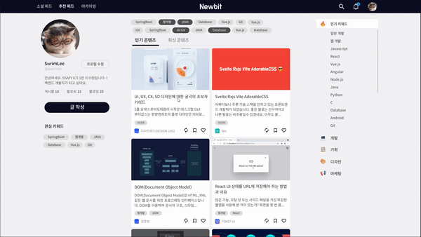

내가 관심있어하는 `키워드` 를 기반으로 기술 블로그 글들을 선별해 제공합니다. Velog, Notion, Github 등에 흩어진 기술 블로그들을 한 눈에 보실 수 있습니다. 편하고 빠르게 주요 기술 블로그 글들을 모아서 읽어보세요!

큐레이팅 피드에서는 사용자의  `관심 키워드` 에 알맞는 기술블로그 글들을 우선적으로 추천합니다. 큐레이션 피드 상단의 `키워드 칩` 을 클릭하거나 화면 우측의 `키워드 바` 에서 키워드를 선택해 언제든지 새로운 기술 블로그 컨텐츠를 제공받을 수 있습니다. 

마음에 드는 글들 중 나중에 읽고 싶은 글을 `아카이빙` 하실 수 있고, 다른 이들과 함께 읽고 싶다면 `소셜 피드` 에 공유할 수 있습니다.    


### (2) 소셜

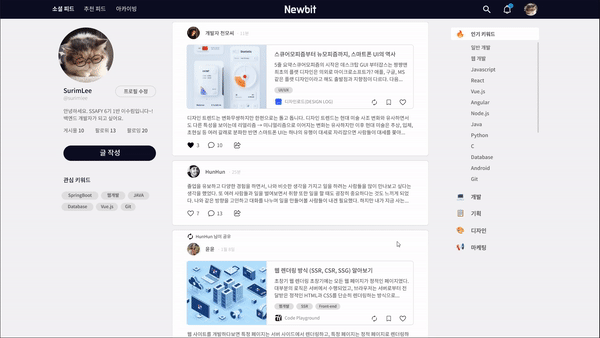

좋은 `컨텐츠` 들을 다른 사람에게 `추천`하고, `의견`을 남기며 실시간 `소통`이 가능합니다. 댓글, 좋아요, 공유, 답글 등 `기존의 SNS 사용자` 들이 친숙하게 사용하는 대부분의 기능들이 구현되어 기존의 SNS를 사용해보신 분들이라면 누구나 `직관적으로 서비스를 활용`할 수 있습니다. 


### (3) 아카이빙

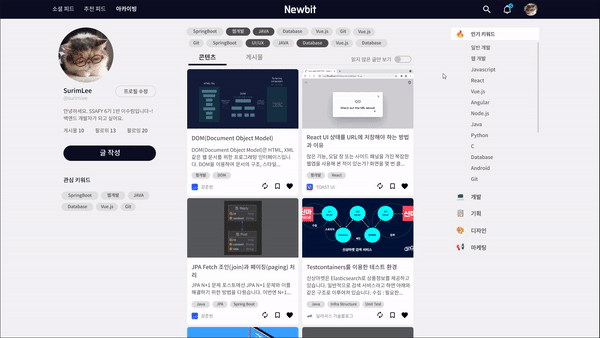

나중에 읽어보고싶은 글들은 `아카이빙` 해둔 뒤 언제든지 다시 확인할 수 있습니다. `기술 블로그의 컨텐츠` 부터 다른 사람들의 게시물까지 모두 아카이빙이 가능합니다. 아직 `읽지 않을 글` 을 먼저 살펴보거나 `키워드`별로 글을 `재분류` 할 수 있습니다.

## 6) 기술 스택

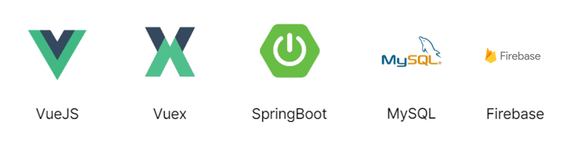

🖱**Backend**

- IntelliJ
- spring boot 2.6.3
- Spring Security
- Java 8
- AWS EC2
- MySQL
- MyBatis 2.2.1
- lombok
- swagger

🖱**Frontend**

- Vue2
- Vuetify
- Vuex
- Vue router
- Axios

🖱**CI/CD**

- aws ec2
- nginx
- jenkins

# 2. 기획

## 1) 화면정의서

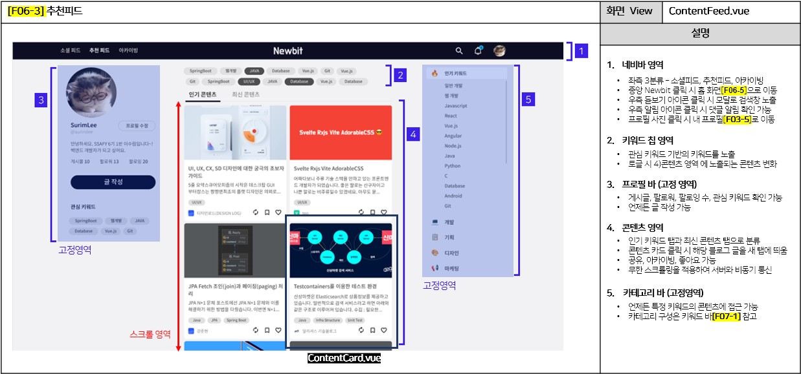

## 2) 와이어프레임

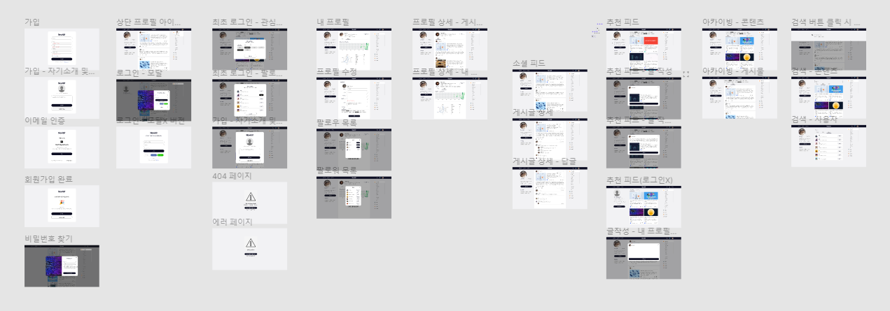

Figma 에서 살펴보기

👉[https://www.figma.com/file/3Yc8FTFfCSgsZhxIR3m7bS/Newbit?node-id=0%3A1](https://www.figma.com/file/3Yc8FTFfCSgsZhxIR3m7bS/Newbit?node-id=0%3A1)

영상으로 자세히 보기

👉[https://youtu.be/n6Ijs8BZ3ts](https://youtu.be/n6Ijs8BZ3ts)

## 3) 컴포넌트 구조도(FE)

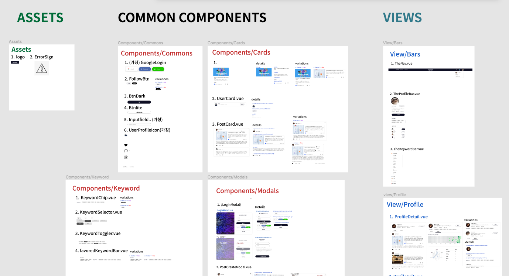

Figma 에서 살펴보기

👉 [https://www.figma.com/file/3Yc8FTFfCSgsZhxIR3m7bS/?node-id=421%3A1276](https://www.figma.com/file/3Yc8FTFfCSgsZhxIR3m7bS/?node-id=421%3A1276)

# 3. 설계

## 1) 시퀀스 다이어그램

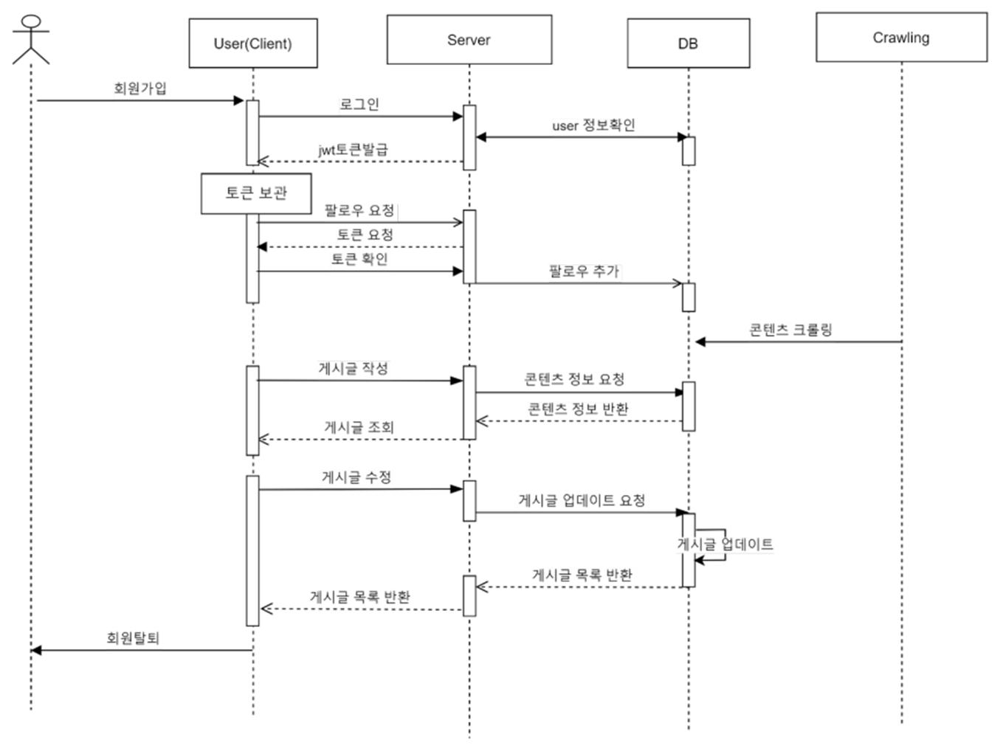

## 2) 유스케이스 다이어그램

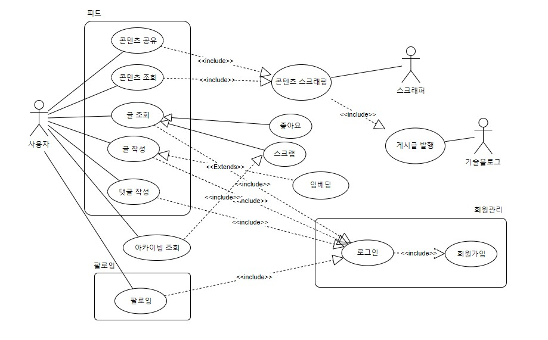

## 3) ERD

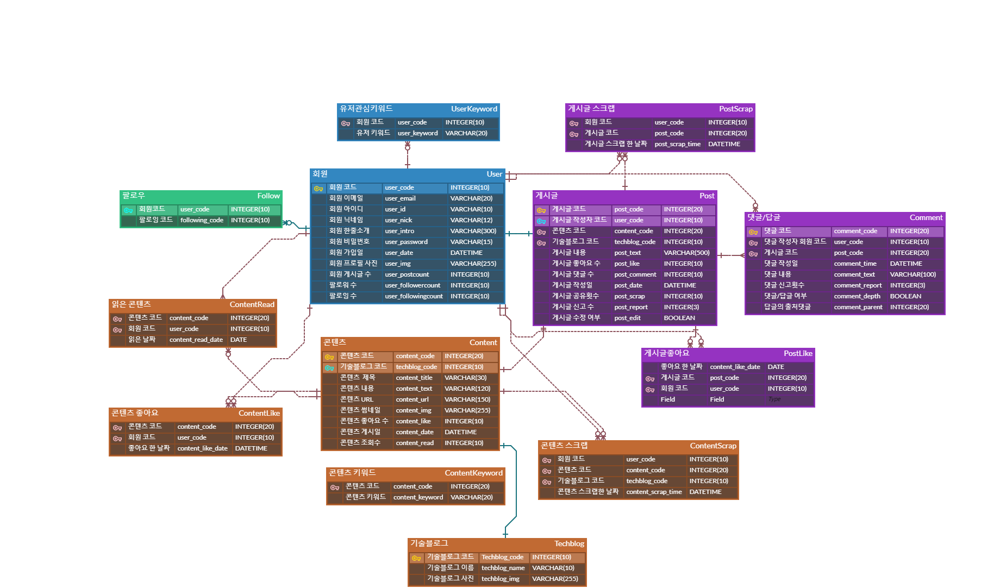

## 4) 요구사항 정의서

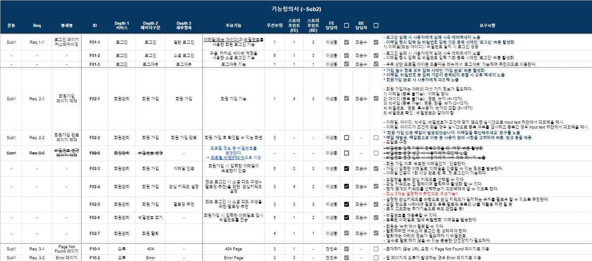

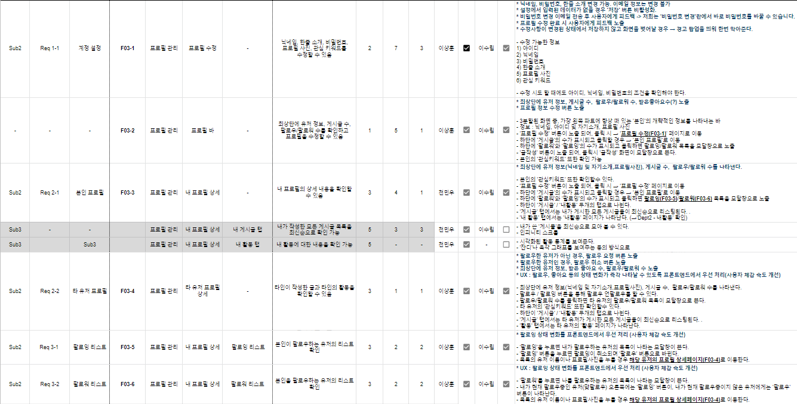

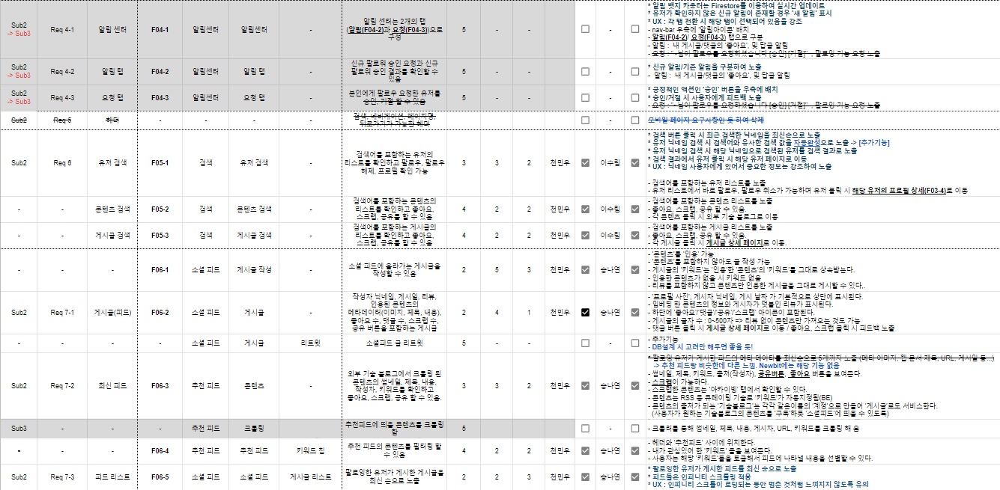

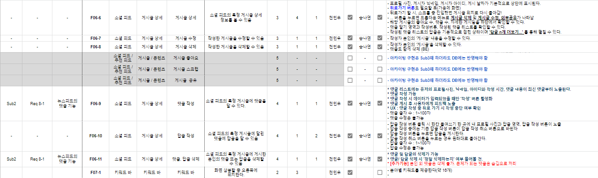

## 5) API 설계서

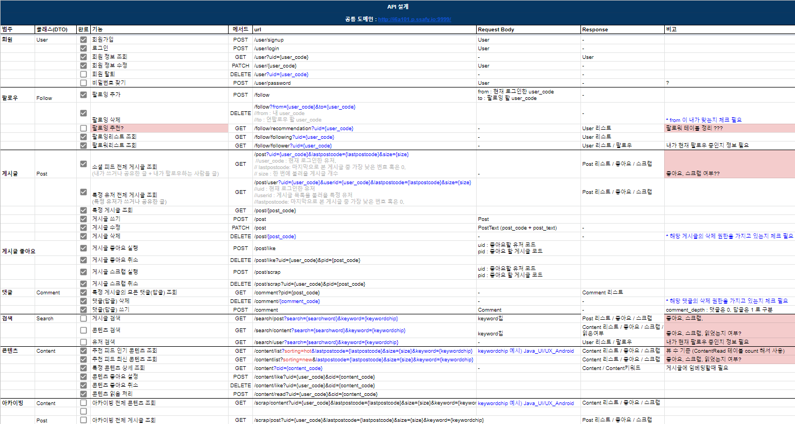

## 6) 시스템 구성도

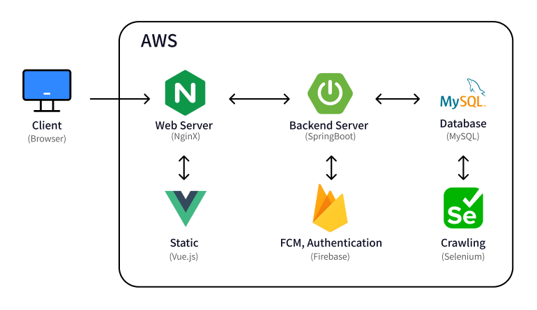

# 3. 설치 및 사용법

깃랩에 접속해 `clone` 받으신 후, `clone` 받은 디렉토리에서 아래의 순서대로 설치를 진행합니다.  

[깃랩 주소](https://lab.ssafy.com/s06-webmobile2-sub2/S06P12A101)

## 1) 백엔드

- [http://i6a101.p.ssafy.io:9999/](http://i6a101.p.ssafy.io:9999/) 이하로 요청 시 테스트 가능
- 사용법
  - clone 받은 후 sts나 IntelliJ에서 프로젝트 우클릭
  - Run as SpringBoot App으로 실행

## 2) 프론트엔드

- Node.js 설치

[Node.js](https://nodejs.org/ko/)

- 프론트엔드 디렉토리로 이동.

```bash
cd {클론 받은 폴더}/frontend/newbit
```

- 아래의 명령어를 실행

```bash
npm install
npm run serve
```

# 4. 협업

## 1) Git 활용

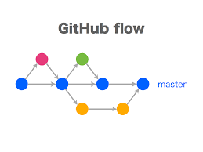

## 2) Git 컨벤션

- **브랜치 이름**

      유형/이슈넘버(jira)/기능ID/요약

- **Commit 메시지**

      TYPE: 커밋내용 [#JIRA-ISSUE]

- **Commit 유형**

```
FEAT: 🎸 새로운 기능 추가 [#S06P12A101-89]
FIX: 🐛 버그 수정 
DOCS: ✏️ 문서 수정
CHORE: 🤖 그 외 자잘한 작업
TEST: 💍 테스트 코드
BUILD: 🏹 시스템 또는 외부 종속성에 영향을 미치는 변경사항 (npm, gulp, yarn 레벨)
CI: 🎡 CI관련 설정
STYLE: 💄 코드 의미에 영향을 주지 않는 변경사항 (포맷, 세미콜론 누락, 공백 등)
REFACTOR: 💡 성능 개선
MERGE: 🎉 기능 개발 후 브랜치 병합
```

## 3) Jira

기능들을 `Jira` Issue로 등록, `업무 진행 상황`을 관리합니다. issue 누락 방지를 위해 스프레드시트를 함께 활용합니다. 스프레드 시트에 기능별 ID, 스토리포인트, 담당자 등을 배분한 뒤 Jira issue를 등록합니다.

참고자료 1: 


참고자료 2: 

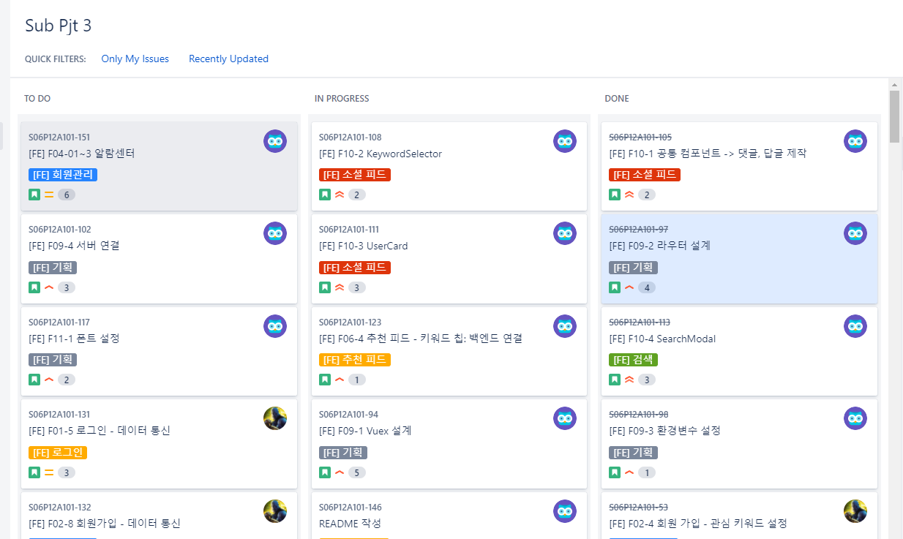

## 4) Notion

### (1) 일정 관리

전체 일정 및 진척상황을 일목요연하게 확인할 수 있습니다.

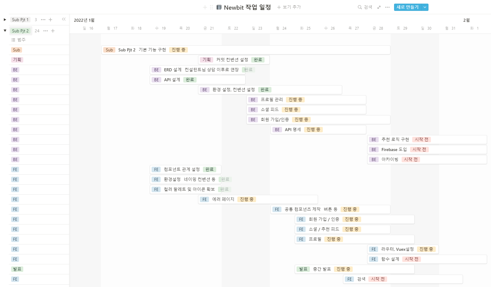

### (2) 컨벤션 및 환경 설정 공유

협업에 필요한 규칙들과 설정들을 `매뉴얼화`하여 일목요연하게 관리합니다. 각종 환경 설정이나 설치법 등을 공유하여 셋팅 오류를 최소화하고 개발에 집중할 수 있습니다. 


### (3) 참고자료 공유

참고할 만한 `외부 자료` 등을 `문서화` 후 공유하고 있습니다. 코딩 시 발생했던 `오류`들 또한 `문서화`하여 추후 `동일 문제가 발생`할 시 `신속하게 해결`할 수 있습니다. 

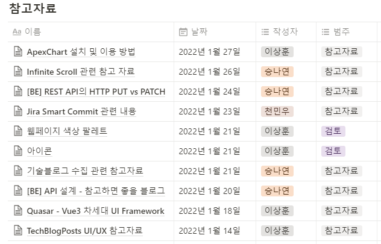

### (4) 회의록 관리

팀원간 활발한 의사소통과 기획의 효율성을 높이기 위해 `꾸준한 회의`를 진행했으며, 회의록을 노션에 정리하고 필요시 참고할 수 있도록 했습니다. 

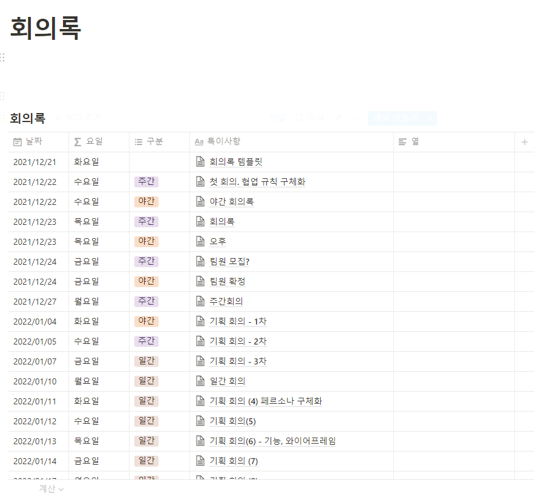
